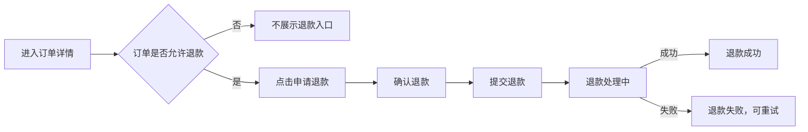

# 示例：《订单退款》功能需求片段

> 本示例只用于演示写法，不代表完整业务方案。

## 1. 需求概述

用户可以在符合退款条件的订单详情页发起退款。系统需要根据订单状态判断是否允许退款，并在提交后明确展示处理状态及最终结果。

## 2. 主流程

## 3. 页面与交互

### 3.1 订单详情页

**页面目标**  
用户查看订单状态，并在符合条件时发起退款。

#### FR-01 退款入口展示

- **可见条件**：订单已支付且尚未进入不可退款阶段。
- **系统行为**：满足条件时展示“申请退款”；不满足时不展示入口。
- **关联规则**：BR-01。

#### FR-02 提交退款

- **触发方式**：用户点击“申请退款”，并在确认弹窗中确认。
- **系统行为**：提交成功后立即进入“退款处理中”，避免用户误以为退款已经完成。
- **处理中**：不得再次创建新的退款申请；页面展示当前申请状态。
- **最终成功**：订单展示“退款成功”。
- **最终失败**：展示明确失败状态，并允许用户在满足业务条件时重试。
- **[待确认]**：处理中超过多长时间后，应向用户展示超时或延迟提示。

## 4. 业务规则

| ID | 规则 | 结果 |
|---|---|---|
| BR-01 | 只有符合退款资格的订单才允许发起退款 | 不符合时不展示退款入口 |
| BR-02 | 同一订单存在处理中退款时，不允许再次发起 | 保持当前退款状态，不创建第二笔申请 |
| BR-03 | 已退款成功的订单不可再次退款 | 不展示退款入口 |

## 5. 异常与边界

| 场景 | 预期行为 | 用户反馈 |
|---|---|---|
| 用户重复点击确认 | 只保留一笔有效退款操作 | 按钮进入处理中状态 |
| 订单状态已被其他流程改变 | 重新校验退款资格 | 提示当前订单已不满足退款条件 |
| 提交失败 | 不进入退款成功状态 | 提示提交失败，可重新尝试 |
| 最终退款失败 | 保留失败结果 | 展示失败状态及可用后续操作 |

## 6. 验收标准

### AC-01 — 符合条件的订单可以发起退款

**前提**：用户查看一个满足退款条件的订单  
**当**：用户进入订单详情页  
**那么**：页面展示“申请退款”入口

### AC-02 — 处理中不可重复发起

**前提**：当前订单已有一笔退款正在处理  
**当**：用户再次进入订单详情或尝试发起退款  
**那么**：系统不创建第二笔退款操作  
**并且**：页面展示现有退款处理状态

### AC-03 — 状态变化后重新校验

**前提**：用户打开页面时订单可退款  
**并且**：提交前订单状态已经发生变化  
**当**：用户确认退款  
**那么**：系统重新校验退款资格  
**并且**：如果已不满足条件，则不创建退款操作并向用户说明原因
