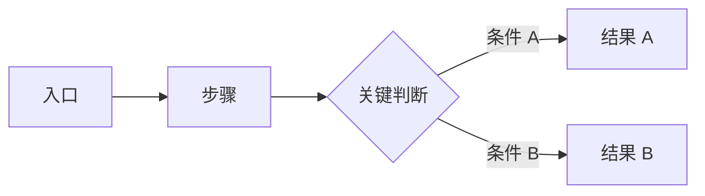
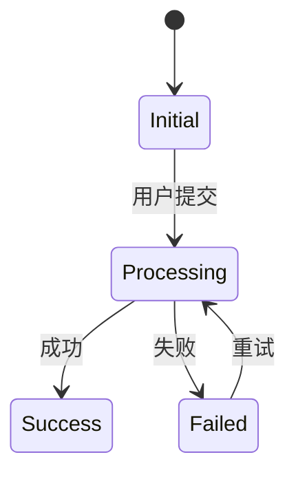

# 《[功能名称]》功能需求文档

> 文档状态：草稿 / 评审中 / 已确认  
> 产品原型：[链接或附件]  
> 技术方案：[链接或附件]  
> 相关资料：[链接或附件]

## 1. 需求概述

### 1.1 一句话说明

[用 1～3 句话说明本次功能变化是什么、谁会使用、最终要完成什么。]

### 1.2 目标

- [目标 1]
- [目标 2]

### 1.3 本期范围

**包含**

- [本期实现内容]

**不包含**

- [明确的非目标 / 后续阶段]

## 2. 用户角色与使用场景

| 角色 | 使用场景 | 可执行的关键操作 | 关键限制 |
|---|---|---|---|
| [角色] | [场景] | [操作] | [限制] |

## 3. 整体业务 / 用户流程

### 3.1 主流程

### 3.2 流程说明

1. [步骤及用户目标]
2. [步骤及系统行为]
3. [分支条件及结果]

### 3.3 关键分支

| 分支 | 条件 | 系统行为 | 用户看到的结果 |
|---|---|---|---|
| [分支] | [条件] | [行为] | [结果] |

## 4. 页面与交互说明

> 按真实用户流程组织，不要机械地按页面控件罗列。

### 4.1 [页面 / 模块 / 对话框名称]

**页面目标**  
[用户到这个页面要完成什么。]

**入口与前置条件**

- 入口：[从哪里进入]
- 前置条件：[角色 / 状态 / 数据条件]

**原型**  
[截图 / 图号 / 原型链接]

#### 4.1.1 页面状态

| 状态 | 触发条件 | 页面表现 | 可执行操作 |
|---|---|---|---|
| 初始 | [条件] | [表现] | [操作] |
| 加载中 | [条件] | [表现] | [操作] |
| 空数据 | [条件] | [表现] | [操作] |
| 成功 | [条件] | [表现] | [操作] |
| 失败 | [条件] | [表现] | [操作] |

#### 4.1.2 关键交互

##### FR-01 [交互名称]

- **触发方式**：[用户做什么]
- **可用条件**：[何时可见 / 可点击]
- **系统行为**：[触发后系统应该发生什么]
- **用户反馈**：[加载提示 / 轻提示 / 弹窗 / 页面跳转 / 状态更新]
- **完成结果**：[最终状态]
- **失败处理**：[失败 / 超时 / 重试]
- **关联规则**：[BR-xx]

##### FR-02 [交互名称]

[同上]

## 5. 业务规则

| ID | 规则 | 条件 / 优先级 | 结果 | 备注 |
|---|---|---|---|---|
| BR-01 | [规则] | [条件] | [结果] | [说明] |

### 5.1 冲突规则 / 优先级

[当多个条件同时满足时，明确哪个规则优先。]

## 6. 状态与状态转换

> 仅在功能存在明显生命周期时保留。

> Mermaid 的状态标识符受语法限制可以保留英文，但在表格和正文中应使用中文状态名称。

| 当前状态 | 触发事件 | 条件 | 下一状态 | 用户可执行操作 |
|---|---|---|---|---|
| [状态] | [事件] | [条件] | [状态] | [操作] |

## 7. 权限与角色差异

| 功能 / 数据 | 角色 A | 角色 B | 无权限时表现 |
|---|---|---|---|
| [功能] | [权限] | [权限] | [表现] |

## 8. 数据与字段说明

> 只描述影响产品和业务理解的字段。数据库字段和完整接口数据结构放在技术方案。

| 字段 / 概念 | 含义 | 展示 / 使用规则 | 枚举 / 边界 |
|---|---|---|---|
| [字段] | [含义] | [规则] | [范围] |

## 9. 异常与边界场景

| 场景 | 触发条件 | 预期系统行为 | 用户反馈 | 是否可恢复 |
|---|---|---|---|---|
| 重复操作 | [条件] | [行为] | [反馈] | 是 / 否 |
| 请求超时 | [条件] | [行为] | [反馈] | 是 / 否 |
| 权限不足 | [条件] | [行为] | [反馈] | 是 / 否 |
| 数据已变化 | [条件] | [行为] | [反馈] | 是 / 否 |
| 外部依赖异常 | [条件] | [行为] | [反馈] | 是 / 否 |

## 10. 验收标准

### 10.1 功能级检查

- [ ] [正常主流程可以完成]
- [ ] [关键分支行为符合业务规则]
- [ ] [重要异常有明确反馈和恢复方式]
- [ ] [权限和状态限制生效]

### 10.2 关键行为场景

#### AC-01 — [场景名称]

**前提**：[前置条件]  
**当**：[触发行为]  
**那么**：[预期结果]  
**并且**：[补充可观察结果]

#### AC-02 — [场景名称]

**前提**：...  
**当**：...  
**那么**：...

## 11. 技术约束（仅保留影响产品行为的部分）

> 详细实现见技术方案：[链接]

- [例如：操作结果异步返回，因此页面必须存在“处理中”状态]
- [例如：外部系统存在延迟，因此需要定义等待和超时表现]

## 12. 待确认事项

| ID | 问题 | 为什么需要确认 | 影响范围 | 建议 / 当前推断 |
|---|---|---|---|---|
| Q-01 | [问题] | [原因] | [范围] | [建议或推断] |

## 13. 需求追踪（中大型需求可选）

| 需求 | 原型 / 页面 | 业务规则 | 验收标准 |
|---|---|---|---|
| FR-01 | [页面] | BR-01 | AC-01、AC-02 |

## 14. 参考资料

- 产品原型：[链接]
- 技术方案：[链接]
- 相关需求 / 工单：[链接]
- 其他：[链接]
